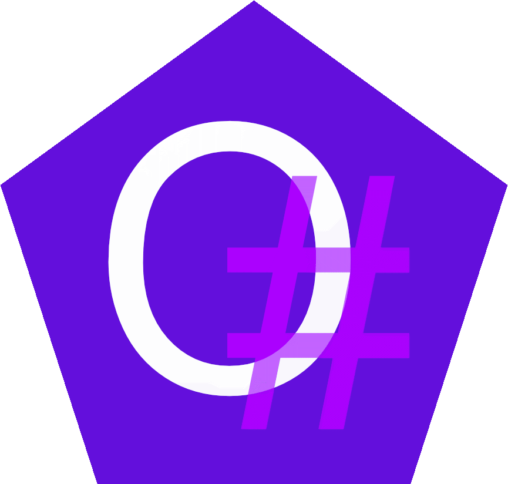

<p align="center">
<br>
<h1 align="center">OskarSharp</h1>
</p>

A simple, statically typed programming language focused on code generation, compiling into C#


### Important
**NOTE**: A major rewrite is in progess, the old transpiler is being replaced and language spec being updated!

### Goals
- Advance code generation
- Imperative and strongly typed
- Cross platform
- Simple
- Enjoyable

## To-do
- [ ] Finalise new spec
- [ ] Implement new transpiler
- [ ] Remove legacy from project

## Dependencies
- Python 3
- Dotnet

## Build (legacy)
**NOTE**: This is not a compiler and merely "finds and replaces" the instances of text to their C# counterpart as such will replace this text inside of comments and strings so should **not** be used in production!
```sh
    git clone https://github.com/KnotMasterAz/OskarSharp.git
    cd OskarSharp
    python legacy/start.py code/hello.oskar --run --Console # Compile using the legacy compiler
```

## Examples

### Hello, World!
```cs
//V0.1.0+
fun:pure main() {
    print("Hello, Knots!")
}
```

### Calculator
```cs
//V0.1.1+
fun:pure main() {
    print_online("Number 1: ")
    float64 num1 = csh.Convert.ToDouble(read())

    print_online("Operator (+, -, *, /): ")
    string op = read()

    print_online("Number 2: ")
    float64 num2 = csh.Convert.ToDouble(read())

    float64 result = sum(num1, op, num2)

    print($"{num1} {op} {num2} = {result}")

    print("Hit enter to close program!")
    read()
}

fun:float64 sum(float64 num1, string op, float64 num2) {   
    switch (op) {
        case "*":
            return num1 * num2

        case "/":
            return num1 / num2

        case "-":
            return num1 - num2

        case "+":
            return num1 + num2
        
        default:
            print("Error: Invalid operator!");
            return -404
    }
}
```

### Licence
[Licence](LICENSE)
